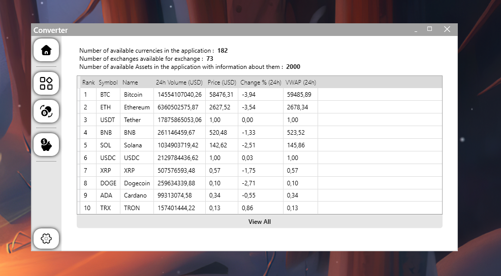

# WPF Converter



WPFConverter gives you markup easy access to cryptocurrencies and conversions using the [CoinCap API 2.0](https://docs.coincap.io).

Gives you that kind of opportunity : 

- View Assets
- Volute conversion 
- View Exchanges

Visual part :

- Nice interface 
- Change application theme (dark/light)

# How to run

There are two ways to run the program, either downloading from [releases](https://github.com/PalmaLuv/WPFConverterMoney/releases) and simply running it, or compiling it using VisualStrudio or the .NET CLI

### To run through VisualStudio

Copy the repository to any folder

```bash
git clone https://github.com/PalmaLuv/WPFConverterMoney.git
```

And open the WPFAppConverter.csproj file using VisualStudio. After that we generate a solution for the project 

### To run through .NET CLI

Copy the repository to any folder

```bash
git clone https://github.com/PalmaLuv/WPFConverterMoney.git
```

Then write the following commands

```bash
dotnet build
dotnet run
```
